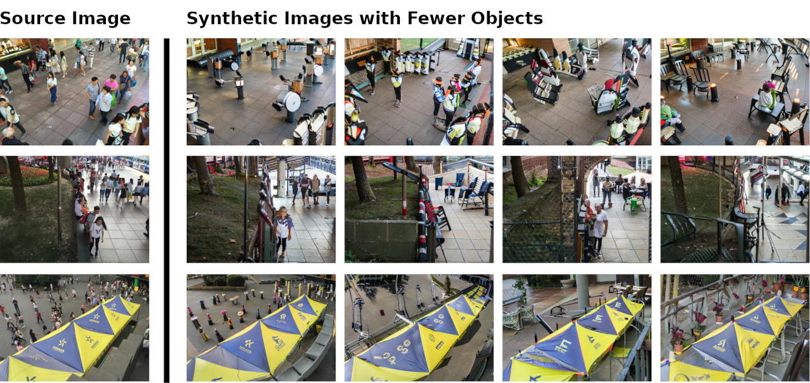

# SYRAC: Synthesize, Rank, & Count


[](https://github.com/tensorflow/tensorflow/releases/tag/v2.8.0)
[](https://www.tensorflow.org/addons/overview)

> **Adriano D'Alessandro, Ali Mahdavi-Amiri \& Ghassan Hamarneh**  
>  Crowd counting is a critical task in computer vision, with several important applications. However, existing counting methods rely on labor-intensive density map annotations, necessitating the manual localization of each individual pedestrian. While recent efforts have attempted to alleviate the annotation burden through weakly or semi-supervised learning, these approaches fall short of significantly reducing the workload. We propose a novel approach to eliminate the annotation burden by leveraging latent diffusion models to generate synthetic data. However, these models struggle to reliably understand object quantities, leading to noisy annotations when prompted to produce images with a specific quantity of objects. To address this, we use latent diffusion models to create two types of synthetic data: one by removing pedestrians from real images, which generates ranked image pairs with a weak but reliable object quantity signal, and the other by generating synthetic images with a predetermined number of objects, offering a strong but noisy counting signal. Our method utilizes the ranking image pairs for pre-training and then fits a linear layer to the noisy synthetic images using these crowd quantity features. We report state-of-the-art results for unsupervised crowd counting. 



## Overview
We release our code for reproducing the experiments conducted within our paper.


### Data

We will be updating this repository with a link to the synthetic and real data shortly.

## Requirements
```python
tensorflow==2.8
tensorflow_addons==0.16.1
protobuf==4.21.5
scikit_image==0.18.1
tifffile==2023.4.12
```
## Installation

```bash
# Example installation steps
$ git clone https://github.com/adrian-dalessandro/SYRAC.git
$ cd SYRAC
$ pip install -r requirements.txt
```

## Usage
Running the model

```bash
# Training from scratch
$ python train_wrapper.py --experiment training/baseline \ 
                          --params_dir "./config/" \
                          --dataset "YOUR_DATASET" \
                          --data_dir "path/to/dataset" \
                          --experiment_dir "path/to/experiments" \
                          --experiment_name "name_your_experiment"
```
Fine-tuning the model
```bash
# Finetuning pre-trained model
$ python3 finetune_wrapper.py --experiment finetuning/unsupervised/noisy_synth_regress \
                         --data_dir "path/to/dataset" \
                         --train_data "DS_NOISY_SYNTH" \
                         --test_data "YOUR_DATASET" \
                         --N 2 \
                         --experiment_path "path/to/experiments" \
                         --model_path "path_to_saved_model" \
                         --params_dir "./config/"
```

## License

While crowd counting has legitimate usecases, such as urban planning, event management, and retail analysis. However, it also involves human surveillance, which we should always be deeply skeptical of. Given ths, we release all source code under the Open RAIL-S LICENSE in an attempt to mitigate downstream misuse.
